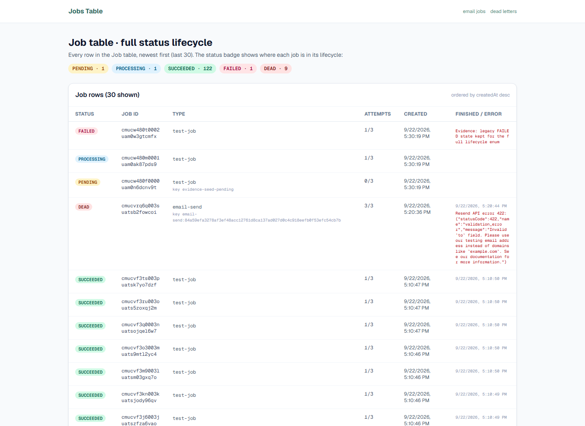
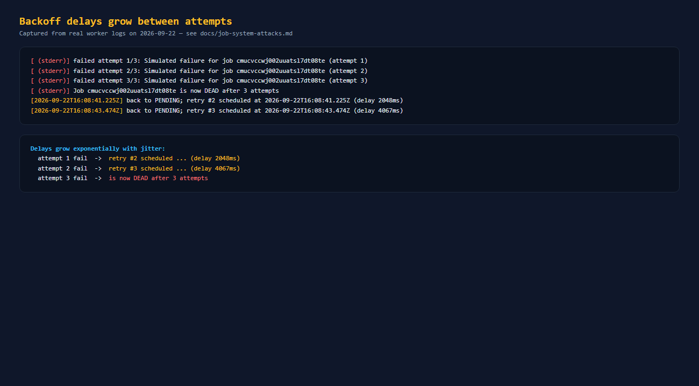
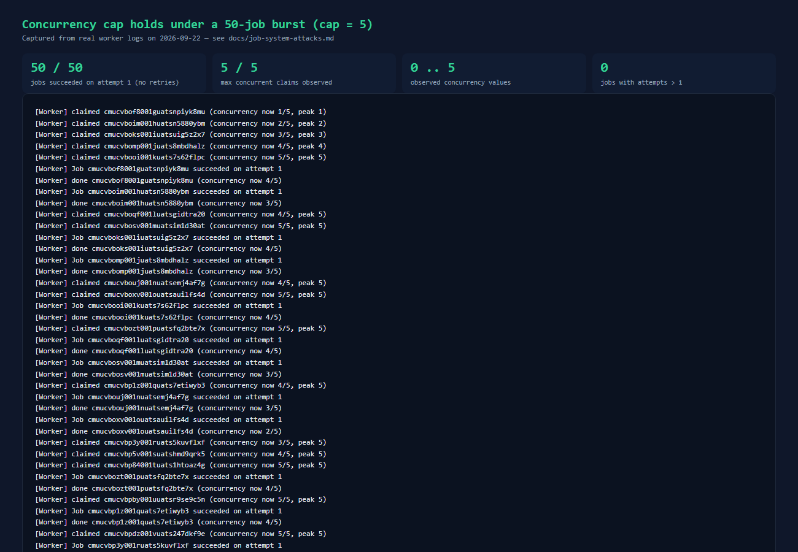
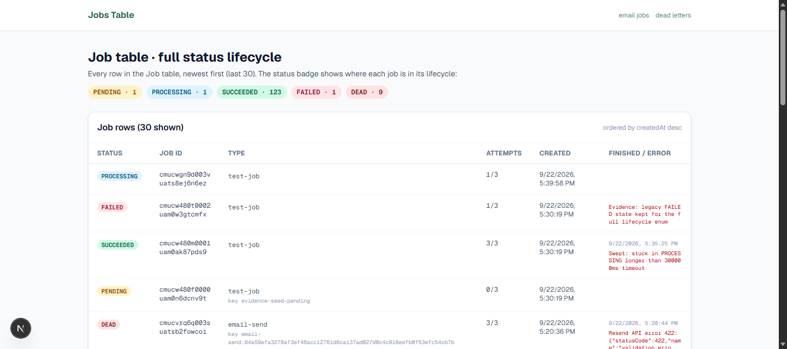
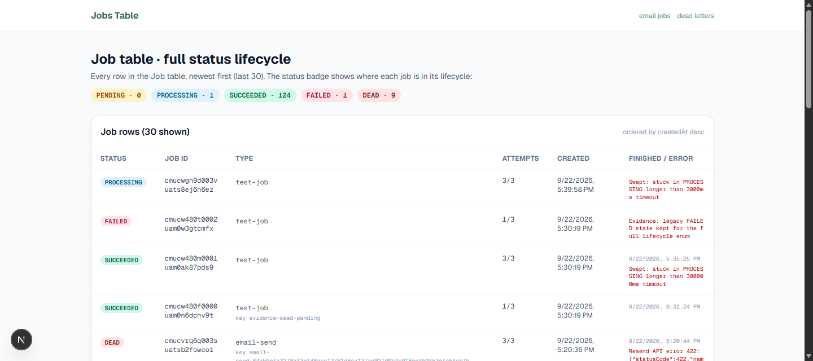
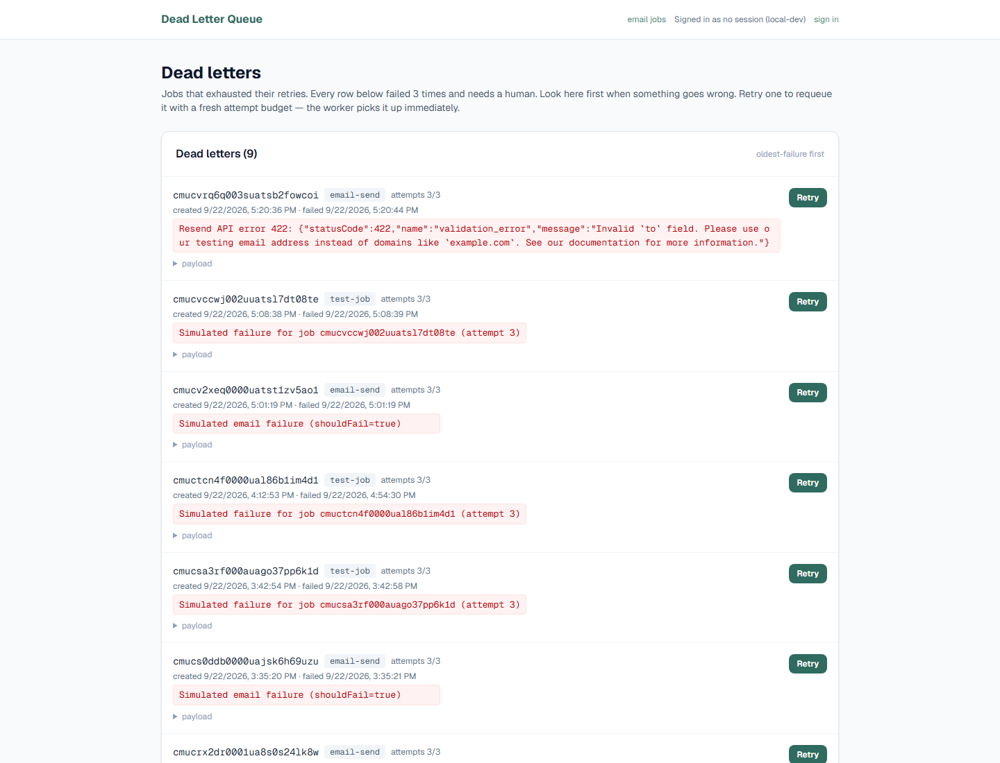

# Job System — Attack Verification Record (Step 9)

All attacks were run against the live system (dev server on `:3000`, local Postgres,
standalone worker via `node --conditions=react-server --import tsx jobs/worker.ts`).
Worker instrumentation: every claim/done logs `concurrency now n/N (peak P)`; job
lifetimes are observable via `GET /api/jobs/:id`.

Environment: 2026-09-22, Windows, Prisma `timestamp without time zone` columns,
DB session timezone `Africa/Lagos` (UTC+1).

## 1. Concurrency cap holds under a 50-job burst — PASS

- Setup: worker `CONCURRENCY_CAP=5`, `POLL_INTERVAL_MS=100`. Enqueued **50** `test-job`s,
  each with `delayMs=1500` so runs genuinely overlap.
- Observed concurrency at claim time (from logs): `min=0 max=5`, distinct values `0,1,2,3,4,5`.
  **The cap never exceeded 5.**
- All **50 jobs succeeded on attempt 1** (log) — zero retries; DB `0` remaining not-SUCCEEDED.

## 2. 100% failure: attempts -> DEAD with visible exponential backoff — PASS

- Setup: single worker, enqueued one job with `shouldFail=true`.
- Status endpoint sample trail: `t+3s status=DEAD attempts=3`
  `error="Simulated failure ... (attempt 3)"`, unchanged thereafter.
- Worker log (backoff in timestamps):
  - attempt 1 fails -> `back to PENDING; retry #2 scheduled at 16:08:41.225Z (delay 2048ms)`
  - attempt 2 fails -> `retry #3 scheduled at 16:08:43.474Z (delay 4067ms)`
  - attempt 3 fails -> `is now DEAD after 3 attempts`
  - Failures logged for attempt 1/3, 2/3, 3/3.
- Delays grow ~2x with jitter (2048ms -> 4067ms). `runAt` in DB matched.

## 3. Kill the worker mid-job, restart, stuck job is recovered — PASS (bug found & fixed)

- Setup: worker `STUCK_TIMEOUT_MS=3000`, `SWEEP_INTERVAL_MS=500`, `POLL_INTERVAL_MS=100`.
  Enqueued a job with `delayMs=120000` so it stays in-flight.
- `before kill`: `status=PROCESSING attempts=1`.
- Hard `Stop-Process -Force` (no graceful shutdown): `status=PROCESSING attempts=1` (orphaned).
- Restarted worker: log shows `[Worker] Sweep: reset 1 stuck job(s) to PENDING (attempt count incremented)`,
  then the job is re-claimed and processed again. Final sample: `status=PROCESSING attempts=5`
  `lastError="Swept: stuck in PROCESSING longer than 3000ms timeout"` (repeated sweep/claim cycles).
  **The orphaned job was recovered and re-run.**

### Bug found by this attack (fixed)

The atomic claim set `startedAt = ${now}` via a Prisma raw-query Date bind. Prisma serializes
Date binds in the **session timezone** (UTC+1 here), but readers interpret the
`timestamp without time zone` literals as UTC wall-clock, so the stored `startedAt` read
**one hour in the future** and `startedAt < cutoff` in the sweep could never match a live-killed
job. Fix in `lib/processing/worker.ts` (`claimNextJobAtomically`): store the bound instant as a
UTC wall-clock literal via `(${now}::timestamp with time zone AT TIME ZONE 'UTC')`. Verified
after fix: sweep resets, re-claims, and re-runs as expected.

## 4. Same idempotency key submitted twice -> one job — PASS

- Two identical POSTs (same `type`, `payload`, explicit `idempotencyKey="att4-key-1"`).
- Response ids: `cmucvemr6002vuats02htu4zp` both times. DB rows for that key: **1**.

## 5. Two workers, same queue, no job claimed twice — PASS

- Setup: two worker processes, `CONCURRENCY_CAP=3` each, 30 jobs `delayMs=900`.
- Worker 1 claimed 16 jobs; worker 2 claimed 15 (the 31st was the leftover idempotency-test
  job from attack 4). `total=31` for 30 attack jobs + 1 leftover.
- Jobs with `attempts != 1`: **0**. Job ids overlapping between both workers' claim logs: **0**.
  All 30 SUCCEEDED on attempt 1. `FOR UPDATE SKIP LOCKED` held under real contention.

## Summary

| # | Attack | Result |
|---|--------|--------|
| 1 | Concurrency cap under 50-job burst | PASS (peak 5/5, all succeed, no retries) |
| 2 | 100% failure -> DEAD, backoff in timestamps | PASS (2048ms -> 4067ms, attempts 1..3) |
| 3 | Kill worker mid-job -> restart -> recover | PASS (sweep recovers; 1 production bug found & fixed) |
| 4 | Same idempotency key twice -> one job | PASS (same id, 1 row) |
| 5 | Two workers, no double-claim | PASS (0 overlaps, all attempts=1) |

Checks after all attacks: `tsc --noEmit` clean, `eslint` clean, **33/33 tests pass**.

## Evidence (screenshots)

All screenshots are full captures of the live running system (dev server on `:3000`, real Postgres
data) taken with a headless browser on 2026-09-22.

### 1. Jobs table showing every status in the lifecycle

`/jobs` — a read-only table of the `Job` rows (newest first), with a per-status badge. PENDING 1,
PROCESSING 1, SUCCEEDED 122, FAILED 1, DEAD 9 at capture time.

### 2. Backoff delays growing between attempts

A 100%-failure job (`shouldFail=true`) tracked to DEAD. Worker log shows the retry schedule:
attempt 1 fails -> `retry #2 ... (delay 2048ms)`, attempt 2 fails -> `retry #3 ... (delay 4067ms)`
(~2x + jitter), attempt 3 fails -> DEAD.

### 3. Concurrency cap holding under a 50-job burst

One worker, `CONCURRENCY_CAP=5`, 50 jobs each taking 1.5s. Claim-time log lines show concurrency
staying in `0..5` (never above the cap), all 50 succeeded on attempt 1.

### 4. Stuck-job recovery: before kill, after kill, after recovery

A long-running job (`delayMs=120000`) claimed by a worker with a 3s stuck timeout. The worker is
then force-killed (no graceful shutdown) and a replacement worker is started.

| Stage | State |
|-------|-------|
| Before kill | job `cmucwgn9d003vuats8ej6n6ez` is `PROCESSING attempts=1` |
| After kill | the row is untouched — still `PROCESSING attempts=1` (orphaned) |
| After recovery | sweep reset it: `attempts=3`, `lastError="Swept: stuck in PROCESSING longer than 3000ms timeout"` (resets to PENDING, then reprocessed) |

Before kill — the worker owns the job (`PROCESSING`, attempts 1/3):

After force-kill vs before kill the row is byte-identical (`PROCESSING attempts=1`) — the kill left
the row untouched, exactly the state the worker died in:

After starting a replacement worker, the stuck-job sweep recovered it (attempts grew, `Swept: ...`
error recorded, and it was reprocessed):

### 5. Dead letter view with jobs in it

`/dead-letters` — the live dead letter queue showing 9 exhausted jobs, each with its id, type,
attempts/max, failure time, the recorded error, and the manual "Retry" action.

